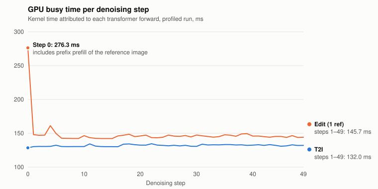
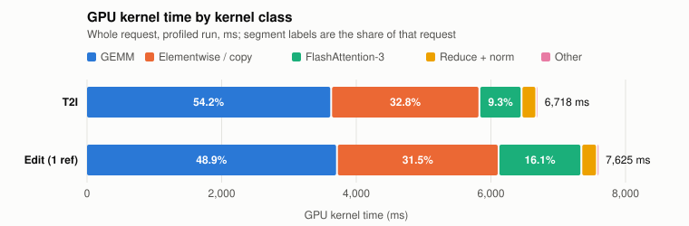

# A0: Qwen-Image 2.1 single-request baseline and per-stage profile (H200)

Item **A0** of [vllm-project/vllm-omni#8586](https://github.com/vllm-project/vllm-omni/issues/8586).
The plan (hypothesis, controls, run budget, stop condition) was declared in [README.md](README.md) before measurement.

## Setup

| | |
|---|---|
| Code | vllm-omni `3dc35694b3d4` (clean checkout, no local changes), base image `vllm/vllm-openai:v0.31.0` |
| Packages | vllm 0.31.0, torch 2.13.0+cu130, transformers 5.14.1, diffusers 0.40.0, triton 3.7.1 |
| Model | `Qwen/Qwen-Image-2.1@d26bb61231c3` |
| Hardware | 1× NVIDIA H200 141 GB (Modal), driver 580.95.05; GPU UUIDs in each `env.json` |
| Workload | BF16, eager (`enforce_eager=True`), 1024×1024, 50 steps, seed 42, `true_cfg_scale=1.0`. Default prefix KV cache; no offload, quantization, or VAE tiling |
| T2I prompt | "A ceramic teapot on a wooden table" |
| Edit | Same settings plus one reference image, the recipe's `qwen_bear.png` (514×556, committed as `inputs/qwen_bear.png`); prompt "Let this mascot dance under the moon, surrounded by floating stars", as in the recipe's editing example |
| Budget | Per config: 1 warmup (excluded), 1 feasibility run, 2 measured runs, all in one engine process. Traces, and the `--mem` and `--stages` diagnostics (warmup + 2 measured), come from separate runs and are not used for the headline timing |

## 1. Latency: the baseline reproduces

| | T2I | Edit (1 ref) |
|---|---:|---:|
| **Wall time / image** (measured, n=2) | **7.387 s ± 0.014** | **8.363 s ± 0.001** |
| Published (recipe, H200 eager BF16) | 7.34 s → **+0.6%** | — |
| `diffuse` (50 steps) | 7.180 s (97.2%) | 7.999 s (95.6%) |
| `text_encoder.forward` | 0.040 s (0.5%) | 0.076 s (0.9%) |
| `vae.encode` | — | 0.033 s (0.4%) |
| `vae.decode` | 0.111 s (1.5%) | 0.111 s (1.3%) |
| Outside these four stages (broken down below) | 0.056 s (0.8%) | 0.144 s (1.7%) |
| Engine init (excluded) | 34.9 s | 29.1 s |
| Failures / OOM | 0 | 0 |
| Output determinism | 4/4 runs bit-identical | 4/4 bit-identical |

Stage times come from `--enable-diffusion-pipeline-profiler` (synchronized). Raw rows: `results/*_time/runs.jsonl`.

Measurement boundaries:

- Wall time covers one `omni.generate(...)` call. Engine init, the warmup, and PNG encoding/writing of the output are outside it. The engine's own `stage_0_gen_ms` agrees within 3 ms (7.384 s T2I, 8.361 s edit).
- "±" is the sample standard deviation of the two measured runs in one engine process (the declared budget), not a confidence interval. It understates the spread between containers; see the end of this section.
- The stock profiler times `text_encoder.forward`, `vae.encode`, `diffuse`, and `vae.decode` only (its `tokenizer.forward` target does not exist on this pipeline).

### Full stage accounting

The four stock stages leave 0.8% (T2I) and 1.7% (edit) of the request unnamed. A separate diagnostic run (`--stages`) times every step of a request, using the same warmup + 2 measured budget. It is not a timing baseline: `bench/stagehook` extends the pipeline's profiler targets and wraps the pre/post-process functions at import, which is a local modification of the pinned checkout and adds synchronization points.

| Step (indented = contained in the row above) | T2I | Edit (1 ref) |
|---|---:|---:|
| **Wall time** (this run, n=2) | **7.357 s** | **8.426 s** |
| `pre_process` (resize reference images) | 0.000 s | 0.067 s (0.8%) |
| `QwenImage21Pipeline.forward` | 7.290 s (99.1%) | 8.321 s (98.8%) |
| &nbsp;&nbsp;`_prepare_generation_context` | 0.048 s (0.6%) | 0.176 s (2.1%) |
| &nbsp;&nbsp;&nbsp;&nbsp;`encode_prompt` | 0.047 s | 0.134 s |
| &nbsp;&nbsp;&nbsp;&nbsp;&nbsp;&nbsp;`text_encoder.forward` | 0.043 s | 0.082 s |
| &nbsp;&nbsp;&nbsp;&nbsp;`prepare_latents` | 0.000 s | 0.039 s |
| &nbsp;&nbsp;&nbsp;&nbsp;&nbsp;&nbsp;`vae.encode` | — | 0.033 s |
| &nbsp;&nbsp;&nbsp;&nbsp;`prepare_timesteps` | 0.001 s | 0.000 s |
| &nbsp;&nbsp;`diffuse` | 7.128 s (96.9%) | 8.031 s (95.3%) |
| &nbsp;&nbsp;`_decode_latents` | 0.114 s (1.6%) | 0.113 s (1.3%) |
| &nbsp;&nbsp;&nbsp;&nbsp;`vae.decode` | 0.113 s | 0.112 s |
| `post_process` (tensor → PIL) | 0.061 s (0.8%) | 0.032 s (0.4%) |
| **Left over** (engine scheduling and hand-off) | **0.005 s (0.07%)** | **0.005 s (0.06%)** |

- The three children of `forward` sum to within 1 ms of it, and `pre_process` + `forward` + `post_process` to within 5 ms of the wall time.
- In T2I, the unnamed time is almost all `post_process`. In editing it is `pre_process`, the part of `encode_prompt` outside the text-encoder forward (0.052 s), and `post_process`.
- Raw data: `results/*_stages/runs.jsonl` and `stage_log.json` (parsed from `engine.log`).

### Spread between containers

Every run landed on a different physical H200 (UUIDs in each `env.json`). Wall time per image, mean of the 2 measured requests:

| Run | T2I | Edit (1 ref) |
|---|---:|---:|
| Timing baseline (clean checkout) | 7.387 s | 8.363 s |
| `--mem` diagnostic (runner DEBUG logging) | 7.438 s | 8.501 s |
| `--stages` diagnostic (extra timing points) | 7.357 s | 8.426 s |

The range is 1.1% for T2I and 1.6% for editing, against 0.2% and 0.01% within one process. The three rows differ in instrumentation as well as hardware, so this is not a clean variance estimate, but differences of 1–2% between separate runs should not be read as effects.

**Outputs** (measured run 0 of each configuration):

| T2I output | Edit reference (`qwen_bear.png`) | Edit output |
|:---:|:---:|:---:|
|  |  |  |

## 2. Serving path and response encoding (T2I)

`vllm serve ... --omni --enforce-eager`, sequential `/v1/images/generations` requests with `response_format=b64_json`, measured n=2:

| | |
|---|---:|
| Process-to-ready (including weight load) | 72.1 s |
| Client total latency | **7.453 s** |
| Engine `stage_gen_time_ms` | 7.342 s |
| Engine `denoise_step_latency_ms` | 142.8 ms per step (× 50 = 7.14 s of the 7.342 s) |
| **Server: generation done → response sent** (PNG encode + base64 + JSON) | **≈ 0.105 s (1.4%)** |
| Response body transfer (5.6 MB JSON, 4.2 MB PNG) | 0.006 s |
| Client JSON / base64 / PNG decode | 0.009 / 0.012 / 0.020 s |

Serving outputs are **pixel-identical** to offline outputs. The PNG bytes differ only because of the PNG encoder.

Cross-check with `benchmarks/diffusion/diffusion_benchmark_serving.py` (`--dataset random --max-concurrency 1`, 3 prompts, 0 failures): engine `stage_0_gen_ms` 7.375 s, consistent with the 7.342 s above.

## 3. Where the time goes inside denoising (torch-profiler traces)

These proportions come from profiled runs, which are slower. Analysis: `python3 bench/analyze_trace.py <trace>`. Figures: `python3 bench/plot_trace.py <t2i trace_analysis.json> <edit trace_analysis.json>`.

**Per step, GPU busy time vs wall time**

| | T2I | Edit |
|---|---:|---:|
| GPU busy, step 0 | 128.5 ms | **276.3 ms** (includes prefix prefill of the reference image) |
| GPU busy, steps 1–49 (mean) | 132.0 ms | 145.7 ms (+10%) |
| Unprofiled wall time per step (`diffuse`/50) | 143.6 ms | 160.0 ms |
| Kernels per step | ≈1,700 | ≈1,720 |

- In T2I eager mode, about **8% of each step is GPU idle** (143.6 ms wall vs 132.0 ms of kernels). The cause is launch/host overhead from about 1,700 small kernels per step. This is the headroom for CUDA Graph and compile (A2).
- With a short T2I prompt, **prefix prefill is negligible**: step 0 costs the same as the other steps.
- With one reference image, prefill adds **about 131 ms once** (step 0). Every later step is **about 14 ms slower** because attention runs over the longer cached prefix. Edit attention kernel time doubles (626 → 1,230 ms over 50 steps). Together these account for most of the +0.82 s `diffuse` difference.

**GPU time by kernel class** (whole request)

| | T2I | Edit |
|---|---:|---:|
| GEMM (almost all `nvjet_sm90_tst_256x128`) | **54.2%** | 48.9% |
| Elementwise / copy / cat / dtype casts | **32.8%** | 31.5% |
| FlashAttention-3 (SM90) | 9.3% | 16.1% |
| Reduce + norm | 3.2% | 3.0% |

**GPU time by module** (share of transformer-block time; T2I / Edit)

- Attention module (QKV/out projections, Q/K norm, RoPE, attention): 48.8% / 53.6%
- SwiGLU MLP: 40.7% / 36.8%
- Remainder (AdaLN modulation, residuals, gating): ~10%

## 4. Memory

All values are binary units (1 GiB = 1024³ bytes).

| | T2I | Edit (1 ref) | Source |
|---|---:|---:|---|
| **Peak allocated**, whole request | **36.86 GiB** | **36.87 GiB** | Runner's per-request line (`torch` `max_memory_allocated`), `--mem` run |
| **Peak reserved**, whole request | **38.12 GiB** (39,030 MiB) | **39.28 GiB** (40,226 MiB) | Same line (`max_memory_reserved`); equals `peak_memory_mb` in every run |
| Device used | 38.99 GiB (39,925 MiB) | 40.16 GiB (41,121 MiB) | `nvidia-smi` polled every 0.1 s, timing runs; includes the CUDA context |
| Allocated after the request | 30.29 GiB | 30.29 GiB | Memory snapshot, trace run |
| **Peak location** | **VAE decode**, +6.56 GiB | VAE decode, +6.57 GiB | Memory snapshot: stack of the allocation at the peak |
| Highest level during the recorded denoising steps | 30.87 GiB | 32.88 GiB | Memory snapshot (last ~3 s only) |

**Allocated vs reserved.** The runner resets PyTorch's peak counters before each request and reads both afterwards (`diffusion_model_runner._sample_peak_memory_mb`). It returns the **reserved** figure as `peak_memory_mb`, by design, so allocator fragmentation is included, and logs the allocated figure at DEBUG only. The `--mem` run surfaces that line; all three requests of each configuration agree to 0.01 GiB (`results/*_mem/engine_peak_memory.json`, `engine.log`). The same counters read from the benchmark process give identical values (`torch_max_memory_*_gib` in `runs.jsonl`), which also shows the offline diffusion worker runs in the benchmark's process.

**Where the peak is.** The memory snapshot keeps only the last 100,000 allocator events, about 3 s (the final denoising steps, VAE decode, post-processing). Replaying it backwards from the end state gives a peak of 36.86 GiB inside `vae.decode`, set by a 0.56 GiB convolution output (`bench/analyze_memory_snapshot.py`; output in `results/*_trace*/memory_snapshot_analysis.json`). That equals the whole-request peak from the runner, so nothing earlier in the request exceeded it: the peak is VAE decode in both configurations. With a reference image, about 2 GiB more is allocated during the recorded denoising steps (not attributed further), but the peak does not move.

**GB vs GiB, and the recipe's 36.9 GB.** The runner's log line prints bytes / 1024³ with the label "GB", so figures copied from vllm-omni logs are GiB. In decimal units our values would be 39.6 GB allocated and 40.9 GB reserved, far from any published figure, so the published numbers are almost certainly binary too. Which counter the recipe's 36.9 GB reports is not stated in the recipe or in #8099. It is within 0.04 GiB of our peak allocated and 1.2 GiB below our peak reserved. #8099 also lists ~37.7 GB (VAE-tiling table) and ~37.8 GB (Diffusers A/B table) for the same H200 eager BF16 1024² configuration, which match neither of our counters. We therefore report both counters and do not claim the recipe figure is reproduced; its measurement method needs to be confirmed by the recipe author before the recipe is updated.

## 5. Conclusion: largest measured cost

1. **Denoising is 96–97% of end-to-end latency.** Within it:
   - GEMM is about half of GPU time.
   - **Elementwise/copy kernels are about a third**, which points to fusion (A1). This is H200 eager mode. #7945 measured a fusion-only gain on A100 with offload, a different configuration.
   - Launch overhead is about 8% of wall time in eager mode, which points to graph/compile (A2).
2. **For editing**, the extra cost is the reference-image prefix: a one-time ~131 ms prefill plus ~14 ms per step of longer attention. That is the workload for A3/B2.
3. **Peak memory is set by VAE decode**, not by denoising: +6.6 GiB over the 30.3 GiB that stays allocated between requests. VAE tiling is the lever here (C2).
4. Everything outside denoising (pre-processing, prompt and image encoding, VAE decode, post-processing) totals 3.1% of a T2I request and 4.7% of an edit request; no single step exceeds 1.6%. Response encoding on the serving path adds 1.4%.

## Artifacts

- Timing runs: `results/20261008T100913Z_a0_t2i_h200_eager_time`, `results/20261008T125447Z_a0_edit_h200_eager_time_bear`
- Serving: `results/20261008T104032Z_a0_serving_t2i_h200_eager` (`server.log`, `benchmark_c1.json`)
- Trace runs: `results/20261008T101117Z_a0_t2i_h200_eager_trace`, `results/20261008T125451Z_a0_edit_h200_eager_trace_bear` (`trace_analysis.json`, `memory_snapshot_analysis.json`). Full `trace_rank0.json.gz` and the memory snapshot are published as release assets, not committed.
- Memory diagnostic runs: `results/20261008T161941Z_a0_t2i_h200_eager_mem`, `results/20261008T162441Z_a0_edit_h200_eager_mem` (`engine.log`, `engine_peak_memory.json`)
- Stage diagnostic runs: `results/20261008T163033Z_a0_t2i_h200_eager_stages`, `results/20261008T163033Z_a0_edit_h200_eager_stages` (`engine.log`, `stage_log.json`)
- Reproduce the diagnostics: `modal run modal_app.py::a0 --mode t2i --mem --feasibility 0`, and the same with `--stages`; for editing add `--mode edit --image inputs/qwen_bear.png`
- Reproduce: `modal run --detach modal_app.py::all` and `modal run --detach modal_app.py::serving`
